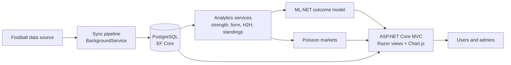

# ZOKA Analytics — Football Analytics and Match Prediction

Full-stack football analytics platform built with ASP.NET Core MVC and ML.NET. ZOKA syncs fixtures and
results into PostgreSQL, builds team statistics, form and head-to-head records, predicts match outcomes with a
machine learning model, derives score-based market probabilities with a Poisson model, and serves everything
through a role-based web app with live match tracking.

> Educational portfolio project. Probabilities are model estimates, not advice.

## Features

- **Daily data pipeline:** a `BackgroundService` runs a multi-step sync (league details, league fixtures,
  current-season backfill, upcoming fixtures by date, statistics rebuild, head-to-head rebuild). Every run is
  recorded in a sync log, and each step can also be triggered from the admin panel.
- **Team analytics:** normalized team strength score (0–100), recent form strings such as `WWDLW`,
  head-to-head summaries and league standings with home/away views.
- **ML.NET outcome model:** a multiclass classifier trained on engineered match features (strength, form,
  table position, head-to-head, home advantage) predicts home win / draw / away win, with a confidence score
  derived from the margin between the top two probabilities. The model is retrained from the admin panel.
- **Manual context adjustments:** effects the data cannot capture (missing key players, derbies, teams with
  nothing left to play for) are applied as explicit, documented coefficients and shown to users as manual
  corrections rather than hidden inside the model.
- **Poisson markets:** expected goals feed a Poisson score matrix that yields probabilities for derived
  markets such as goal totals.
- **Live tracking:** a JSON endpoint refreshes live scores and match minutes on the dashboard every 60 seconds.
- **Users and roles:** ASP.NET Core Identity with admin and user roles, subscription tiers with a daily quota
  on detailed predictions, favourites for teams and matches, and admin tools for tiers and bans.
- **Prediction slips:** users combine predictions into multi-match slips, a weekly builder suggests one, and
  slips are settled automatically against final scores.

## Architecture



| Layer | Technology |
|---|---|
| Web | ASP.NET Core MVC (.NET 10), Razor views, JavaScript |
| Data | PostgreSQL, Entity Framework Core (code-first migrations) |
| Machine learning | ML.NET (FastTree) |
| Auth | ASP.NET Core Identity, role- and tier-based authorization |
| Background jobs | Hosted `BackgroundService` with a stepwise sync runner |

## Project layout

```
Controllers/     Home, Matches, Standings, Coupons, Favorites, Account, Admin
Services/
  Sync/          DailySyncBackgroundService, SyncRunner, SeasonResolver
  Analysis/      TeamStrength, Form, H2H, Standings
  Prediction/    MatchFeatures, PredictionTrainer, MatchPredictionEngine, SubscriptionService
  Markets/       PoissonMarkets
  Coupons/       CouponService, WeeklyCouponBuilder
  FotMob/        HTTP client and DTOs for the fixtures feed
Data/            ApplicationDbContext, DbSeeder
Models/          EF Core entities
Migrations/      EF Core migrations
```

## Getting started

Requires the .NET 10 SDK and PostgreSQL 16.

```bash
createdb zoka_analytics
dotnet tool install --global dotnet-ef
dotnet user-secrets set "AdminSeed:Password" "<a strong password>"
dotnet ef database update
dotnet run
```

The connection string in `appsettings.json` points to a local PostgreSQL instance; override it with
`dotnet user-secrets set "ConnectionStrings:DefaultConnection" "<connection string>"` if yours differs.
On first start the seeder creates the roles, the admin account and the tracked leagues. From the admin panel,
run a sync, train the model and generate predictions.

## Security notes

- Secrets (admin seed password, API keys) live in .NET user-secrets, never in the repository; the app refuses
  to seed an admin account without a configured password.
- Anti-forgery tokens on every state-changing form and account lockout on repeated failed sign-ins.
- Maintenance endpoints under `/dev` are only mapped in the Development environment.
